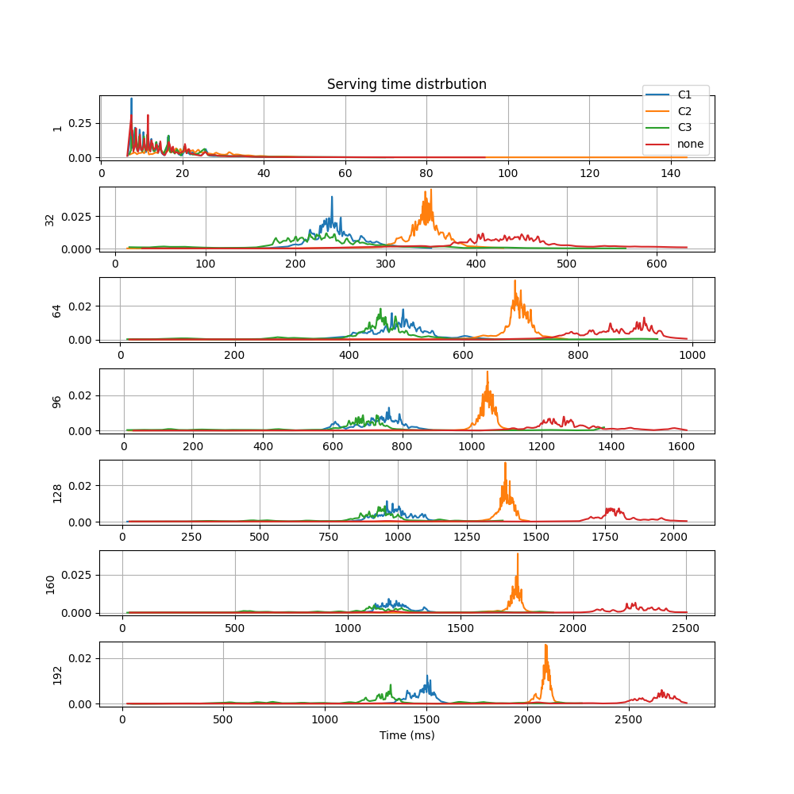
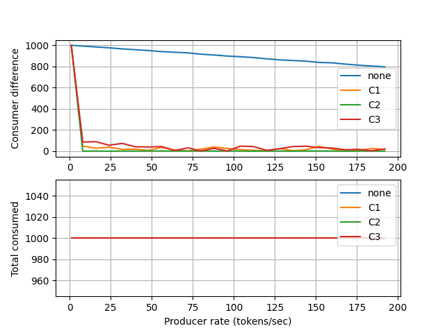

It is recommended to check :doc:`PI Controller </src.pi_controller>`
documentation before going through this document.

Summary
-------

This simulation investigates that a proportional-integral (PI) controller
structure can be used to balance the work load of two HTTP servers which accepts
requests from a single source.

The auto-generated PT net diagram is given below.

In the diagram,

* :math:`p_0` is producing the requests which are represented by tokens with '◆' labels.
  The tokens are generated at a pre-determined rate.
* :math:`e_1` and :math:`e_2` are consumers.
* At :math:`p_1`, the graph is branching and :math:`p_1` is redirecting the request to
  the first available branch found.
* Transition :math:`t_{11}` fires when :math:`k_1, p_1` both have tokens. After
  it fires, the request at :math:`p_1` is transfered to the input buffer :math:`p_{12}` of
  consumer :math:`e_1` through :math:`p_{11}`.
* Transition :math:`t_{21}` fires when :math:`k_2, p_1` both have tokens. After
  it fires, the request at :math:`p_1` is transfered to the input buffer :math:`p_{22}` of
  consumer :math:`e_2` through :math:`p_{21}`.
* Finally, the requests are processed at consumers :math:`e_1` and :math:`e_2`. And,
  each processing takes a random amount of time while the producer can generate tokens
  at a nearly constant rate which can be greater than average processing rate.

**Control rule:**

    The places :math:`k_1` and :math:`k_2` are considered as controllers that aims to balance the
    work load of consumers. Because, :math:`t_{11}` and :math:`t_{21}` can not fire unless :math:`k_i`
    allows. So, :math:`p_1` is forced to redirect request to the enabled branch. After :math:`t_{i1}`
    is fired, the token labeled by '○' will loop back to :math:`k_i` at the next step.

System description
------------------

The simulation consists of

* Producer
* TCP clients at consumers
* HTTP servers
* Conrollers

The whole implementation can be found at
`<https://github.com/dmrokan/soyutnet-simulations/blob/main/src/http_balancer/main.py>`__

Compared to the :doc:`PI Controller </src.pi_controller>` simulation the only difference
is the implementation of the producer and consumers.

Producer
^^^^^^^^

In this case, the main asyncio loop starts a `Uvicorn <https://www.uvicorn.org>`__ HTTP server.

.. literalinclude:: ../../src/http_balancer/main.py
   :language: python
   :lines: 602-605
   :lineno-start: 602

A new token is generated when the HTTP server receives a request. The request data is
binded to the token.

.. literalinclude:: ../../src/http_balancer/main.py
   :language: python
   :lines: 273-292
   :lineno-start: 273

Then, the token is injected to the PT net. However, only the label and ID of token
travels through the net. The binded object is registered in the :py:attr:`soyutnet.SoyutNet.TokenRegistry`.

.. literalinclude:: ../../src/http_balancer/main.py
   :language: python
   :lines: 302-308
   :lineno-start: 302

Consumers
^^^^^^^^^

Similar to the :doc:`PI Controller </src.pi_controller>` simulation, consumers :math:`e_1` and
:math:`e_2` receive tokens as a label and ID. Then they convert it to the actual token as
given below.

.. literalinclude:: ../../src/http_balancer/main.py
   :language: python
   :lines: 387-411
   :lineno-start: 387

Then consumers redirect the HTTP request defined by the token to the actual HTTP servers
running in children processes.

.. literalinclude:: ../../src/http_balancer/main.py
   :language: python
   :lines: 312-368
   :lineno-start: 312

Finally, the HTTP response is sent to original source by ``await uvicorn_send(...)`` lines.

HTTP servers
^^^^^^^^^^^^

The simulation runs two additional instances of Uvicorn HTTP servers in children processes
which echo back the body of POST requests.

.. literalinclude:: ../../src/http_balancer/main.py
   :language: python
   :lines: 60-99
   :lineno-start: 60

It imitates doing a time consuming work by sleeping.

Controllers
-----------

This simulations uses the same controller schemes in :doc:`PI Controller </src.pi_controller>` simulation.
Additionally, a new control scheme is implemented which is labeled by 'C3'.

C3
^^^

The controller scheme :ref:`C2 <C2>` aims to make number of requests processed by two consumer equal
by applying a PI control rule to the difference between the number of requests processed.
It purposedly delays a branch if it is processing faster than the other.

'C3' considers the time consumed while processing requests instead of the number of requests.
It tries to minimize the processing time for both consumers and also the difference between their
total processing times.

.. literalinclude:: ../../src/http_balancer/main.py
   :language: python
   :lines: 416-475
   :lineno-start: 416

Results
-------

It is assumed that, the processing time of servers are modeled by an exponential random variable
with an average processing delay of 0.01 seconds (100Hz).

Each simulation starts an `ab (server benchmarking tool) <https://httpd.apache.org/docs/current/programs/ab.html>`__ process
which sends 1000 POST requests with 1024 byte request body size and varying number of concurrent requests.

``ab`` tool can save the results in CSV file with the structure below.

.. code-block::

    Percentage served,Time in ms
    0,5.614
    1,6.456
    2,6.487
    3,6.529
    4,6.612
    5,6.646
    6,6.664

For example 5th line show that, 4% of requests replied in less than 6.65 milliseconds.

In summary, the same simulation run for three different controllers and several different
number of concurrent requests and CSV files are obtained.

The figure below plots CSV files for one of the concurrency levels. The x axis shows the
data in the second column of the CSV format given above. The y axis shows the first
column divided by 100.

.. figure:: ../../src/http_balancer/result_1.png
   :align: center

The plot resembles a cumulative normal distrbution. When the numerical derivate of
y axis data is taken with respect to x axis data, the plots below is obtained for
different number of concurrent requests.

   The x axis is time and the y axis is time distrbution for different number of concurrent
   requests. The integer values on the left of plots show the number of concurrent requests.
   As the number of concurrent requests increases, the average serving time increases.

   The difference between consumed requests of two HTTP servers for different control schemes.
   The x axis is the number of concurrent requests and the y axis shows the difference between
   the number of requests consumed by two HTTP servers and the total number of requests consumed.

Comments
^^^^^^^^

* Plots resemble a normal distrbution with varying mean and standard deviations.
* Mean value of the serving time is smallest for controller type 'C3' and 'C1'.
* Mean is larger but deviation from mean is smaller for 'C2'.
* Controller 'C3' has a smaller mean serving time than 'C1' for larger number of requesters.
  Its response can be fine tuned by adjusting the contributions of error terms below

.. literalinclude:: ../../src/http_balancer/main.py
   :language: python
   :lines: 459-462
   :lineno-start: 459

* Controller 'C2' performs better if closer to "deterministic" service time is required.
* The second plot is very similar to the results of :ref:`PI Controller <src.pi_controller:results>`
    * The number of consumed requests are equal for 'C2'.

Reproduce
^^^^^^^^^

.. code:: bash

    sudo apt install python3-venv apache2-utils
    python3 -m venv venv
    source venv/bin/activate

    make build
    make build=http_balancer
    make run=http_balancer
    make results=http_balancer
    make graph=http_balancer
    make docs

:ref:`Usage <usage_http_balancer>`
^^^^^^^^^^^^^^^^^^^^^^^^^^^^^^^^^^
