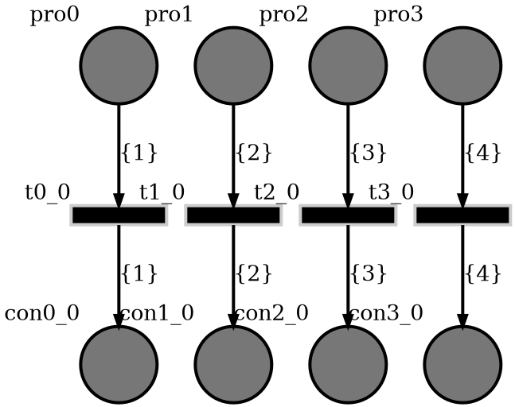
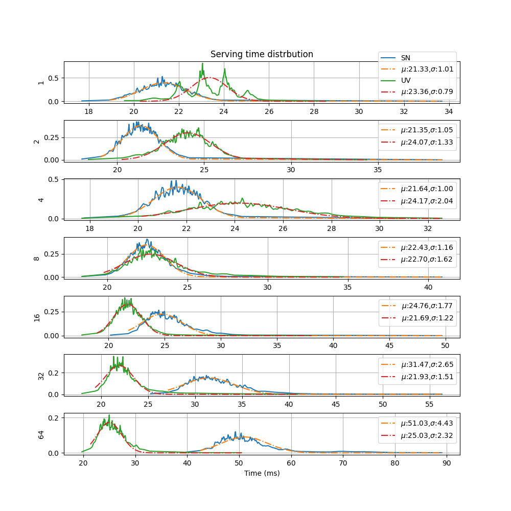

Summary
-------

This simulation investigates how a SoyutNet based load distribution
performs compared to a plain asyncio socket server implemented by
`Uvicorn <https://www.uvicorn.org>`__ for different number of concurrent
requesters.

The auto-generated PT net diagram is given below for 4 concurrent requesters.
Let us denote the number of concurrent requesters by :math:`N`.

In the diagram,

* ``pro0`` to ``pro3`` are producers and requests are distributed to these producers.
* ``con0_0`` to ``con3_0`` are consumers and reads requests data and writes response to the socket.
* It is assumed that, the processing time of each requests takes an amount of time distributed
  according to the normal distribution with mean, :math:`\mu` and standard deviation :math:`\sigma`.
* All arc labels are different. (:math:`\left\{1\right\}` to :math:`\left\{N\right\}`)

In this simulation

* :math:`\mu = 0.02 sec`
* :math:`\sigma = 0.001 sec`

Each simulation starts an `ab (server benchmarking tool) <https://httpd.apache.org/docs/current/programs/ab.html>`__ process
which sends 4096 POST requests with 1024 byte request body size and varying number of concurrent requests.

System description
------------------

The only implementational difference between Uvicorn and this simulation is:

* The asyncio task loop :math:`3N` additional tasks added by SoyutNet.
* Requests are handled after passing through 2 ``asyncio.Queues``.

The whole implementation can be found at
`<https://github.com/dmrokan/soyutnet-simulations/blob/main/src/http_server/main.py>`__

Producer
^^^^^^^^

In this case, the main asyncio loop starts a `Uvicorn <https://www.uvicorn.org>`__ HTTP server.

.. literalinclude:: ../../src/http_server/main.py
   :language: python
   :lines: 199-225
   :lineno-start: 199

The ``canceller`` task waits for benchmarking tool to be completed by checking its process status
using ``psutil`` library. Then, it ends the simulation.

A new token is generated when the HTTP server receives a request. The request data is
binded to the token.

.. literalinclude:: ../../src/http_server/main.py
   :language: python
   :lines: 103-138
   :lineno-start: 103

Then, the token is injected to the PT net. However, only the label and ID of token
travels through the net. The binded object is registered in the :py:attr:`soyutnet.SoyutNet.TokenRegistry`.

Consumers
^^^^^^^^^

Similar to the :doc:`PI Controller </src.pi_controller>` simulation, consumers :math:`e_1` and
:math:`e_2` receive tokens as a label and ID. Then they convert it to the actual token as
given below.

.. literalinclude:: ../../src/http_server/main.py
   :language: python
   :lines: 140-175
   :lineno-start: 140

The Uvicorn application's implementation is in
`<https://github.com/dmrokan/soyutnet-simulations/blob/main/src/http_server/uvicorn_main.py>`__

Controllers
-----------

SN
^^^

The only implementational difference between Uvicorn and this simulation is:

* The asyncio task loop :math:`3N` additional tasks added by SoyutNet.
* Requests are handled after passing through 2 ``asyncio.Queues``.

UV
^^^

This is a plain Uvicorn HTTP echo server which is implemented to compare the results to SN.

Results
-------

It is assumed that, the processing time of servers are modeled by a normal random variable
with an average processing delay of 0.02 seconds (50Hz) and standard deviation if 0.001 seconds.

Each simulation starts an `ab (server benchmarking tool) <https://httpd.apache.org/docs/current/programs/ab.html>`__ process
which sends 4096 POST requests with 1024 byte request body size and varying number of concurrent requests.

``ab`` tool can save the results in CSV file with the structure below.

.. code-block::

    Percentage served,Time in ms
    0,5.614
    1,6.456
    2,6.487
    3,6.529
    4,6.612
    5,6.646
    6,6.664

For example 5th line show that, 4% of requests replied in less than 6.65 milliseconds.

In summary, the same simulation run for three different controllers and several different
number of concurrent requests and CSV files are obtained.

The figure below plots the columns of CSV files. The x axis shows the
data in the second column of the CSV format given above. The y axis shows the first
column divided by 100.

The plot resembles a cumulative normal distrbution. When the numerical derivate of
y axis data is taken with respect to x axis data, the plots below is obtained for
different number of concurrent requests.

   The x axis is time and the y axis is time distrbution for different number of concurrent
   requests. The integer values on the left of plots show the number of concurrent requests.
   As the number of concurrent requests increases, the average serving time increases.

   Also, a gaussian is fit on the data by using the gradient decent solution to the
   nonlinear least squares problem. The plot labels shows the mean (:math:`\mu`) and
   standard deviation (:math:`\sigma`) of the gaussion function which fits the data.

Comments
^^^^^^^^

* SN has a distribution which very closely matches the artifical delay in the HTTP request/response loop.
  But, it gets slower as the number of concurrent requesters goes beyond 8.
* [Work in progress]

Reproduce
^^^^^^^^^

.. code:: bash

    sudo apt install python3-venv apache2-utils
    python3 -m venv venv
    source venv/bin/activate

    make build
    make build=http_server
    make run=http_server
    make results=http_server
    make graph=http_server
    make docs

:ref:`Usage <usage_http_server>`
^^^^^^^^^^^^^^^^^^^^^^^^^^^^^^^^^^
