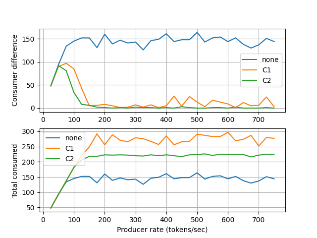

It is recommended to check `SoyutNet <https://soyutnet.readthedocs.io>`__
documentation before going through this document.

Summary
-------

This simulation investigates that a proportional-integral (PI) controller
structure can be used to balance the work load of two TCP servers which accepts
requests from a single source.

The auto-generated PT net diagram is given below.

.. image:: ../../src/pi_controller/graph.png
   :align: center
   :width: 360

In the diagram,

* :math:`p_0` is producing the requests which are represented by tokens with '◆' labels.
  The tokens are generated at a pre-determined rate.
* :math:`e_1` and :math:`e_2` are consumers.
* At :math:`p_1`, the graph is branching and :math:`p_1` is redirecting the request to
  the first available branch found.
* Transition :math:`t_{11}` fires when :math:`k_1, p_1` both have tokens. After
  it fires, the request at :math:`p_1` is transfered to the input buffer :math:`p_{12}` of
  consumer :math:`e_1` through :math:`p_{11}`.
* Transition :math:`t_{21}` fires when :math:`k_2, p_1` both have tokens. After
  it fires, the request at :math:`p_1` is transfered to the input buffer :math:`p_{22}` of
  consumer :math:`e_2` through :math:`p_{21}`.
* Finally, the requests are processed at consumers :math:`e_1` and :math:`e_2`. And,
  each processing takes a random amount of time while the producer can generate tokens
  at a nearly constant rate which can be greater than average processing rate.

**Control rule:**

    The places :math:`k_1` and :math:`k_2` are considered as controllers that aims to balance the
    work load of consumers. Because, :math:`t_{11}` and :math:`t_{21}` can not fire unless :math:`k_i`
    allows. So, :math:`p_1` is forced to redirect request to the enabled branch. After :math:`t_{i1}`
    is fired, the token labeled by '○' will loop back to :math:`k_i` at the next step.

Goal
----

Can you design a control law that makes the number of request processed by both consumers
equal?

System description
------------------

The simulation consists of

* Producer
* TCP clients at consumers
* TCP servers
* Conrollers

The whole implementation can be found at
`<https://github.com/dmrokan/soyutnet-simulations/blob/main/src/pi_controller/main.py>`__

Producer
^^^^^^^^

The producer (:math:`p_0`) is assumed to generate requests (tokens) at a constant rate
and transfers to :math:`p_1` which will redirect it to the first available branch.

In the simulation, the latency on the paths are negligible compared to the production
rate. However, it can be adjusted by ``LOOP_DELAY`` parameter below.

.. literalinclude:: ../../src/pi_controller/main.py
   :language: python
   :lines: 215-219
   :lineno-start: 215

The producer logic is defined as below.

.. literalinclude:: ../../src/pi_controller/main.py
   :language: python
   :lines: 221-227
   :lineno-start: 221

Async function ``producer`` is called in a dedicated asyncio task loop with
the period given by ``PRODUCE_DELAY``. The produced tokens are labeled by
integer value ``L`` (namely '◆').

Consumers
^^^^^^^^^

The consumer functionality is more complex because it communicates
to a TCP server and also constantly notifies the controllers :math:`k_1` and :math:`k_2`.

.. literalinclude:: ../../src/pi_controller/main.py
   :language: python
   :lines: 228-270
   :lineno-start: 228

.. _controllers:

TCP servers
^^^^^^^^^^^

The simulation starts two TCP servers which run in separate child processes and each is
assigned to one of the consumers. The important part is given below.

.. literalinclude:: ../../src/pi_controller/main.py
   :language: python
   :lines: 65-75
   :lineno-start: 65

It imitates doing a time consuming work by sleeping. The duration of sleep
is assumed to be a random number with an adjustable mean value.
The TCP servers can be made imbalanced by purposedly increasing the
the average value of time delay for one of them.

Controllers
-----------

.. _controller_code:

.. literalinclude:: ../../src/pi_controller/main.py
   :language: python
   :lines: 270-309
   :lineno-start: 270

The important lines are

.. code:: python

    value = await sensor.get()
    """Receive a notification from the consumer."""

The controller places :math:`k_i` receive updates from consumers and operate
accordingly.

none
^^^^

When there is no control rule in work, the token labeled by '○' loops through
:math:`p_{i1}` and :math:`k_i` without any delay. The task loop of :math:`p_1`
receives a token from :math:`t_0` at each loop and checks output arcs
for availability. It always redirects the tokens to :math:`t_{11}` because
its always enabled when a new token arrives. At the end, all requests are
redirected to the consumer :math:`e_1`.

C1
^^^

This control rule helps balancing TCP servers, because it waits for a notification
from the consumer which informs that last request to the TCP is replied. So, it
disables its own branch while waiting and lets :math:`p_1` redirect the new token to
the other branch.

.. _C2:

C2
^^^

This one implements a PI control based approach. It aims to make the number of
requests processed by both TCP servers nearly equal. It keeps track of the number of
firings of transitions :math:`t_{13}` and :math:`t_{23}` and tries to make their difference
as minimum as possible.

The measured metric is the number of firings and the control input is the sleep function.
It delays the branch's operation if it is going faster than the other branch.

The advantage of using the number of firings of :math:`t_{i3}` as a measure instead
of the number of tokens processed by the consumers is such that control rule is not
effected by the random processing time of the TCP servers. It measures a partially
deterministic metric. On the other hand, using the sleep function as the control
input introduces an additional delay which limits the total number of processed requests.

Results
-------

It is assumed that, the processing time of servers are modeled by an exponential random variable
with an average processing delay of 0.01 seconds (100Hz). Each simulation takes nearly 3 seconds.

The simulations are run for all controller types and several token producing rates from 25Hz to 750Hz.

   The x axis shows the token producing frequency. The top plot shows the difference between
   number of tokens consumed by :math:`e_1` and :math:`e_2` at each simulation. The bottom
   plot shows the total number of tokens consumed at each simulation.

**Comments:**

* At 25Hz producer rate, consumers process the requests faster than token producing rate
  so 1st branch is always available for redirecting new requests for all control rules.
  There is a big difference between the number of request processed by consumers.
* As producer rate gets close to the average processing delay of consumers (100Hz), the gap
  between consumed requests goes to zero.
* C2 is more successful to balance the number of request processed by consumers, at the expense
  of an additional delay in the control loop as explained in Section `C2`_.
* C1 achieves the best total number of processed requests score and can balance the consumer
  work loads.
* When there is no control rule is present, all requests are piled up in the first consumer's
  (:math:`p_{12}`) input buffer. It produces the worst scenario among others.

P-controller
^^^^^^^^^^^^

.. |controller_code| replace:: :literal:`Ki`

In this case, the integrator gain |controller_code|_ is chosen as zero instead of the default
value ``1e-4``, meaning that only proportional gain is active. The plot below shows the results for
this case.

.. figure:: ../../src/pi_controller/result_2.png
   :align: center

   The results when integrator is disabled.

**Comments:**

* It shows the effectiveness of PI-controller scheme. Because, the controller of a branch (:math:`k_i`)
  tracks the operation of the opposite branch much closely when integrator action is active.

Reproduce
^^^^^^^^^

.. code:: bash

    sudo apt install python3-venv
    python3 -m venv venv
    source venv/bin/activate

    make build
    make build=pi_controller
    make run=pi_controller
    make results=pi_controller

:ref:`Usage <usage>`
^^^^^^^^^^^^^^^^^^^^
