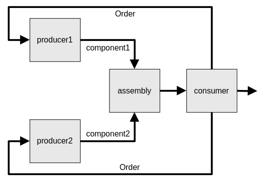
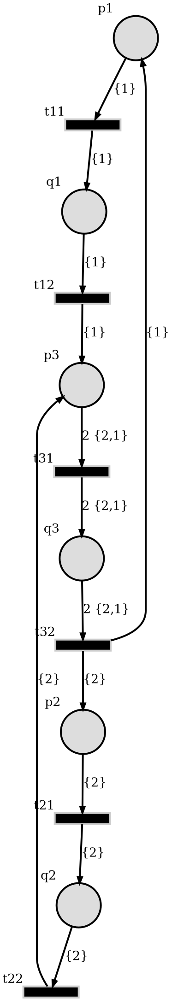

Summary
-------

This simulations implements a temporal-aware PT net by attaching time information
to the PT net tokens. It simulates a supply chain depending on two component
producers and an assembler.

In the diagram,

* ``producer1`` builds ``component1`` in a time interval approximated by
  a normal distribution :math:`\mathcal{N}(\mu_1, \sigma_1)` with the mean
  :math:`\mu_1` and standard deviation :math:`\sigma_1` seconds.
* Similarly ``producer`` builds ``component2`` in a time interval of
  :math:`\mathcal{N}(\mu_2, \sigma_2)`
* The components are assembled and served to the consumer.
* Lastly, the consumer places a new order to the producers.

The diagram below shows the auto-generated PT net by `SoyutNet <https://soyutnet.readthedocs.io/>`__.

* ``p1*`` and ``t1*`` define the producer1.
* ``p2*`` and ``t2*`` define the producer2.
* ``t31`` is the assembler.
* ``p3`` is the consumer.
* The component1 and 2 are labeled by ``{1}`` and ``{2}``.

System description
------------------

SoyutNet `tokens <https://soyutnet.readthedocs.io/en/latest/#data-structures>`__ are
represented by a tuple of integers.

.. code:: python

   token: tuple[int, int] = (label, id)

Time information is embedded into the second item (``id``) of token.
Simulation starts with an initial token at the producers

* ``produer1`` has ``(PRODUCER1_LABEL, T0)``
* ``produer2`` has ``(PRODUCER2_LABEL, T0)``

where ``T0 = 0 (secs)`` initially. Each producer adds a random integer distributed by
:math:`\mathcal{N}(\mu_i, \sigma_i)`, :math:`i \in {1,2}` at a
(``TimedTransition``) instance then sends to their output arcs.

.. literalinclude:: ../../src/timed_net/main.py
   :language: python
   :start-after: timed-tr-defs-start
   :end-before: timed-tr-defs-end
   :lineno-match:

The assembler receives tokens, redirects to the consumer.
The total duration of this process is the maximum of the delay introduced by
producers.

.. literalinclude:: ../../src/timed_net/main.py
   :language: python
   :start-after: combiner-tr-defs-start
   :end-before: combiner-tr-defs-end
   :lineno-match:

The consumer places an other order to the producers after receiving the token.
At each cycle, the token IDs are incremented.

.. math::

   (label, t) \rightarrow (label, t+\Delta t)

The tokens are counted by the consumer and the timings are saved.

.. _saved_timings:

.. literalinclude:: ../../src/timed_net/main.py
   :language: python
   :start-after: stock-counter-defs-start
   :end-before: stock-counter-defs-end
   :lineno-match:

The whole implementation can be found at
`<https://github.com/dmrokan/soyutnet-simulations/blob/main/src/timed_net/main.py>`__

Joint probability distribution
------------------------------

The total duration of the described process is distributed according to

.. math::

   X &= \max{(X_1, X_2)} \\
   X_i &\sim \mathcal{N}(\mu_i, \sigma_i) \Rightarrow E[X_i] = \mu_i, ~Var[X_i] = \sigma_i^2

The mean and variance of :math:`X` is given as

.. _eq_joint_probability:

.. math::

   E[X] & = \mu_1 \Phi(\alpha) + \mu_2 \Phi(-\alpha) + \theta \phi(\alpha) \\
   E[X^2] &= (\sigma_1^2+\mu_1^2) \Phi(\alpha) + (\sigma_2^2+\mu_2^2) \Phi(-\alpha)
   + (\mu_1 + \mu_2) \theta \phi(\alpha) \\
   Var[X] &= E[X^2] - E[X]^2 \\
   \theta &= \sqrt{\sigma_1^2+\sigma_2^2} \\
   \alpha &= \frac{\mu_1-\mu_2}{\theta}

where :math:`\Phi` and :math:`\phi` are the Gaussian functions representing normal random
distributions [nadarajah2008]_.

.. literalinclude:: ../../src/timed_net/results.py
   :language: python
   :start-after: normal-dist-func-defs-start
   :end-before: normal-dist-func-defs-end
   :lineno-match:

Estimate producer delays
------------------------

The problem is developing an algorithm to estimate the producer delays separately
by using the difference between the time a new order is placed and the time when
the product is received.

[Work in progress]

Results
-------

The simulation is run for several different :math:`\mu_i` and :math:`\sigma_i`
as defined below in `__main__.py <https://github.com/dmrokan/soyutnet-simulations/blob/main/src/timed_net/main.py>`__

.. literalinclude:: ../../src/timed_net/__main__.py
   :language: python
   :start-after: rng-params-defs-start
   :end-before: rng-params-defs-end
   :lineno-match:

The table below shows the joint probability distribution characteristics.

* ``mu0`` is :math:`E[X]` in the :ref:`equation <eq_joint_probability>` above.
* ``std0`` is :math:`\sqrt{Var[X]}` in the :ref:`equation <eq_joint_probability>` above.
* ``mu`` is obtained by calculating the mean of the difference of :ref:`saved timings <saved_timings>`.
* ``std`` is obtained by calculating the standard deviation of the difference
  of :ref:`saved timings <saved_timings>`.
* The units are seconds.

.. literalinclude:: ../../src/timed_net/results.txt

References
----------

.. [nadarajah2008] S. Nadarajah and S. Kotz, “Exact Distribution of the Max/Min of Two
                   Gaussian Random Variables,” 2008

Reproduce
^^^^^^^^^

.. code:: bash

    sudo apt install python3-venv graphviz
    python3 -m venv venv
    source venv/bin/activate

    make build
    make build=timed_net
    make clean=timed_net
    make run=timed_net
    make results=timed_net
    make graph=timed_net
    make docs

:ref:`Usage <usage_timed_net>`
^^^^^^^^^^^^^^^^^^^^^^^^^^^^^^^^^^
