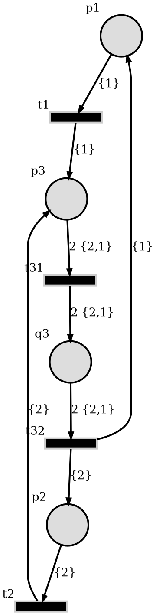

Summary
-------

This simulations implements a temporal-aware PT net by attaching time information
to the PT net tokens. It simulates a supply chain depending on two component
producers and an assembler.

In the diagram,

* ``producer1`` builds ``component1`` in a time interval approximated by
  a normal distribution :math:`\mathcal{N}(\mu_1, \sigma_1)` with the mean
  :math:`\mu_1` and standard deviation :math:`\sigma_1` seconds.
* Similarly ``producer`` builds ``component2`` in a time interval of
  :math:`\mathcal{N}(\mu_2, \sigma_2)`
* The components are assembled and served to the consumer.
* Lastly, the consumer places a new order to the producers.

The picture below is the auto-generated PT net diagram by `SoyutNet <https://soyutnet.readthedocs.io/>`__.

* ``p1*`` and ``t1*`` define the producer1.
* ``p2*`` and ``t2*`` define the producer2.
* ``t31`` is the assembler.
* ``p3`` is the consumer.
* The component1 and 2 are labeled by ``{1}`` and ``{2}``.

System description
------------------

SoyutNet `tokens <https://soyutnet.readthedocs.io/en/latest/#data-structures>`__ are
represented by a tuple of integers.

.. code:: python

   token: tuple[int, int] = (label, id)

Time information is embedded into the second item (``id``) of token.
Simulation starts with an initial token at the producers

* ``produer1`` has ``(PRODUCER1_LABEL, T0)``
* ``produer2`` has ``(PRODUCER2_LABEL, T0)``

where ``T0 = 0 (secs)`` initially. Each producer adds a random integer distributed by
:math:`\mathcal{N}(\mu_i, \sigma_i)`, :math:`i \in {1,2}` at a
(``TimedTransition``) instance then sends to their output arcs.

.. literalinclude:: ../../src/timed_net/main.py
   :language: python
   :start-after: timed-tr-defs-start
   :end-before: timed-tr-defs-end
   :lineno-match:

The assembler receives tokens, redirects to the consumer.
The total duration of this process is the maximum of the delay introduced by
producers.

.. literalinclude:: ../../src/timed_net/main.py
   :language: python
   :start-after: combiner-tr-defs-start
   :end-before: combiner-tr-defs-end
   :lineno-match:

The consumer places an other order to the producers after receiving the token.
At each cycle, the token IDs are incremented.

.. math::

   (label, t) \rightarrow (label, t+\Delta t)

The tokens are counted by the consumer and the timings are saved.

.. _saved_timings:

.. literalinclude:: ../../src/timed_net/main.py
   :language: python
   :start-after: stock-counter-defs-start
   :end-before: stock-counter-defs-end
   :lineno-match:

The whole implementation can be found at
`<https://github.com/dmrokan/soyutnet-simulations/blob/main/src/timed_net/main.py>`__

Joint probability distribution
------------------------------

The total duration of the described process is distributed according to

.. math::

   X &= \max{(X_1, X_2)} \\
   X_i &\sim \mathcal{N}(\mu_i, \sigma_i) \Rightarrow E[X_i] = \mu_i, ~Var[X_i] = \sigma_i^2

The mean and variance of :math:`X` is given as

.. _eq_joint_probability:

.. math::

   E[X] & = \mu_1 \Phi(\alpha) + \mu_2 \Phi(-\alpha) + \theta \phi(\alpha) \\
   E[X^2] &= (\sigma_1^2+\mu_1^2) \Phi(\alpha) + (\sigma_2^2+\mu_2^2) \Phi(-\alpha)
   + (\mu_1 + \mu_2) \theta \phi(\alpha) \\
   Var[X] &= E[X^2] - E[X]^2 \\
   \theta &= \sqrt{\sigma_1^2+\sigma_2^2} \\
   \alpha &= \frac{\mu_1-\mu_2}{\theta}

where :math:`\Phi` and :math:`\phi` are the CDF and PDF of normal random
distribution [nadarajah2008]_.

.. literalinclude:: ../../src/timed_net/results.py
   :language: python
   :start-after: normal-dist-func-defs-start
   :end-before: normal-dist-func-defs-end
   :lineno-match:

Real-time moment estimation
^^^^^^^^^^^^^^^^^^^^^^^^^^^

The moments :math:`E[X], E[X^2]` and variance :math:`Var[X]` can be estimated
by dynamic averaging of observed random variable :math:`x_n`.

.. math::

   E[x_n] &= \mu \\
   Var[x_n] &= E[x_n^2] - \mu^2 = \sigma^2

For this purpose, a special ``list`` class ``NormalSamples`` is implemented.

.. literalinclude:: ../../src/timed_net/main.py
   :language: python
   :start-after: stats-list-defs-start
   :end-before: stats-list-defs-end
   :lineno-match:

As products arrive, the difference between the ordering time and arrival time is
calculated. When this delta time is appended to the ``NormalSamples``, it automatically
updates moments and variance.

.. literalinclude:: ../../src/timed_net/main.py
   :language: python
   :start-after: estimation-defs-start
   :end-before: estimation-defs-end
   :lineno-match:

If last N samples are very close to each other distrbution,
the ``NormalSamples`` instance informs about convergence.

* ``mu`` is the estimate of moment calculated by dynamic averaging.
* ``eps`` the average change in current and previous ``mu``.
* ``eps0`` is the max of last ``self._cc`` number of ``eps`` values
  which is used to determine convergence.

Estimate producer delays
------------------------

The problem is developing an algorithm to estimate the producer delays separately
by using the difference between the time a new order is placed and the time when
the product is received.

System model
^^^^^^^^^^^^

A simple model of the producer/consumer flow can be

.. math::
   x_1[n+1] &= w_1[n] + u_1[n] \\
   x_2[n+1] &= w_2[n] + u_2[n] \\
   x[n+1] &= \max\left\{x_1[n], x_2[n]\right\} \\
   y[n] &= x[n]

* :math:`n` is the product counter starting from zero.
* :math:`x_i` is the production time of component_i.
* :math:`w_i` is a Gaussian random variable,
  :math:`E[w_i] = \mu_i, Var[w_i] = \sigma_i^2`.
* :math:`y = x` is the total production observed by the consumer,
  :math:`E[y] = \mu, Var[y] = \sigma^2`.
* :math:`u_i (sec)` denotes postponing the orders  by the consumer. It is assumed that the consumer
  can schedule orders for later instead of placing them immediately.
* The units are seconds.

State machine observer/controller scheme
^^^^^^^^^^^^^^^^^^^^^^^^^^^^^^^^^^^^^^^^

The observer/controller scheme runs a few tests on the producer/consumer flow.
The order of tests are implemented as a state machine with the states below

.. literalinclude:: ../../src/timed_net/main.py
   :language: python
   :start-after: controller-state-defs-start
   :end-before: controller-state-defs-end
   :lineno-match:

* ``OBSERVE_JOINT_DIST``: Estimate joint mean (:math:`\mu`) and variance (:math:`\sigma`).
* ``TEST_PRODUCER1``: Find out producer1's response by postponing orders.
* ``TEST_PRODUCER2``: Find out producer2's response by postponing orders.
* ``ESTIMATE_DELAYS``: Calculate the difference between :math:`\mu_1` and
  :math:`\mu_2` approximately.
* ``DONE``: Exit simulation.

The state machine is implemented as below.

.. literalinclude:: ../../src/timed_net/main.py
   :language: python
   :start-after: controller-defs-start
   :end-before: controller-defs-end
   :lineno-match:

#. Set :math:`u_1[n] = u_2[n] = 0` for all n,
#. ``OBSERVE_JOINT_DIST``: Estimate the reference :math:`(\mu_0, \sigma_0)` and record.
#. ``TEST_PRODUCER1``: Set :math:`u_1[n] = \mu_0, u_2[n] = 0` for all n.
#. ``OBSERVE_JOINT_DIST``: Estimate :math:`(\mu_1, \sigma_1)` and record.
#. ``TEST_PRODUCER2``: Set :math:`u_1[n] = 0, u_2[n] = \mu_0` for all n.
#. ``OBSERVE_JOINT_DIST``: Estimate :math:`(\mu_2, \sigma_2)` and record.
#. ``ESTIMATE_DELAYS``: The difference between the production time of producers is
   :math:`dt = |\mu_1 - \mu_2|` and the index of slow producer is ``int(dt > 0) + 1``.
#. ``DONE``: Exit.

Integer arithmetic implementation
^^^^^^^^^^^^^^^^^^^^^^^^^^^^^^^^^

In this simulation, all calculations are done on Python's
`Fraction <https://docs.python.org/3/library/fractions.html>`__ instances instead
of ``float`` s. This simulation implements a new class called ``Qp`` to ensure
all basic math operations returns a ``Fraction``.

A ``Fraction`` can be instantiated by an ``int, float, str`` and it converts
the input to a tuple of ``(numerator, denominator)`` of type ``tuple[int, uint]``.
Also, a limit to the denominator can be set. For example:

.. code:: python

   >>> Fraction(-0.3).limit_denominator(10)
   Fraction(-3, 10)
   >>> Fraction(0.3).limit_denominator(2)
   Fraction(1, 2)
   >>> Fraction(0.3).limit_denominator(1)
   Fraction(0, 1)

In the example, ``Fraction(0, 1)`` and ``Fraction(-3, 10)`` are equivalent to :math:`0/1` and
:math:`-3/10`. As the denominator limit increases, the precision of calculations increases.
Because, the numbers less than one can still be represented in the calculations.

.. literalinclude:: ../../src/timed_net/main.py
   :language: python
   :start-after: rational-num-defs-start
   :end-before: rational-num-defs-end
   :lineno-match:

By using this reference implementation, it can be translated to work on an MCU platform.
However, it will require limiting the magnitude of numerator together with the denominator.
Because, the integer size is unlimited in Python.

Results
-------

The simulation is run for several different :math:`\mu_i` and :math:`\sigma_i`
as defined below in `__main__.py <https://github.com/dmrokan/soyutnet-simulations/blob/main/src/timed_net/main.py>`__

.. literalinclude:: ../../src/timed_net/__main__.py
   :language: python
   :start-after: rng-params-defs-start
   :end-before: rng-params-defs-end
   :lineno-match:

The :ref:`table <table_1>` below shows the joint probability distribution characteristics.

* ``mu0`` is :math:`E[X]` in the :ref:`equation <eq_joint_probability>` above.
* ``std0`` is :math:`\sqrt{Var[X]}` in the :ref:`equation <eq_joint_probability>` above.
* ``mu`` is obtained by calculating the mean of the difference of :ref:`saved timings <saved_timings>`.
* ``std`` is obtained by calculating the standard deviation of the difference
  of :ref:`saved timings <saved_timings>`.
* The values are in seconds.

.. |table_1| replace:: Average and actual values.

.. include:: ../../src/timed_net/results.txt
   :start-after: table-1-start
   :end-before: table-1-end

The next :ref:`table <table_2>` shows estimation results.

* ``weak = 1`` means that only mean values are used to determine convergence.
* ``eps`` is the relative error tolerance to determine convergence.
* ``iter`` is the final value of the product counter.
* ``mu``, ``mu0`` and ``Dmu`` are estimated, actual mean value and the relative error.
* ``std``, ``std0`` and ``Dstd`` are estimated, actual standard deviation and the relative error.
* ``slow`` is the estimated slow producer indices ('*' indicates wrong estimation).
* ``Dt``, ``Dt0`` and ``err`` are estimated, actual production delay differences and their relative error.
      e.g. ``slow = 1`` and ``Dt = 1000`` mean the producer1 is 1000 seconds slower than the producer2.
* The values are in seconds except ``weak``, ``iter`` and ``slow``, former are unitless.

.. |table_2| replace:: Observer estimations (when max rational number denominator is 1. Meaning, the mean and variance are calculated by using integer arithmetic).

.. include:: ../../src/timed_net/results.txt
   :start-after: table-2-start
   :end-before: table-2-end

.. |table_3| replace:: Observer estimations (when max rational number denominator is 255).

.. include:: ../../src/timed_net/results.txt
   :start-after: table-3-start
   :end-before: table-3-end

Comments
--------

* :ref:`Table 1 <table_1>` shows that mean and variance is very close to the values
  obtained from the results of :ref:`equations <eq_joint_probability>`.
* :ref:`Table 2 <table_2>` shows that estimator works correctly even if it operates on
  integers. But, it can not estimate the variance by using integer precision.
* :ref:`Table 3 <table_3>` shows that estimator works correctly when fractional numbers
  are used. And, it can more or less estimate the variance.

  It is hard to estimate small differences between :math:`\mu_1` and :math:`\mu_2`.

References
----------

.. [nadarajah2008] S. Nadarajah and S. Kotz, “Exact Distribution of the Max/Min of Two
                   Gaussian Random Variables,” 2008

Reproduce
^^^^^^^^^

.. code:: bash

    sudo apt install python3-venv graphviz
    python3 -m venv venv
    source venv/bin/activate

    make build
    make build=timed_net
    make clean=timed_net
    make run=timed_net
    make results=timed_net
    make graph=timed_net
    make docs

:ref:`Usage <usage_timed_net>`
^^^^^^^^^^^^^^^^^^^^^^^^^^^^^^^^^^
